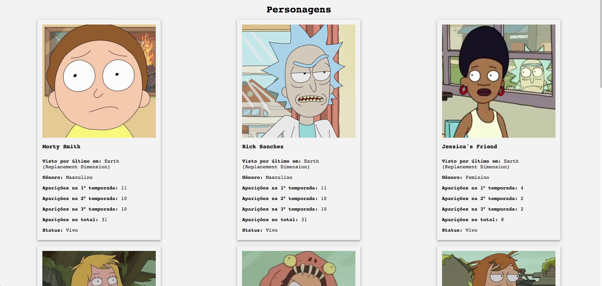

# DESAFIO
 
O desafio era criar uma página estática utilizando express que consome dados de `characters.json` e lidar com os condições propostas e os exibir de forma organizada e responsiva. Porém optei utilizar VUE.JS e EXPRESS. 

## Requisitos do projeto.

* [x] Devem ser listados somentes os personagens vivos.
* [x] Ordenar por: (decrescente) quantidade de aparições, nome (crescente).
* [x] Existem 3 temporadas com 31 episódios ao todo, sendo a primeira temporada com 11 episódios e as restantes com 10 episódios cada.

## Instalação Normal

1. Clone o repositório.
2. Navegue até o diretório do projeto.
3. Instale as dependências com o comando: `npm install`.
4. Inicie o aplicativo com o comando: `npm run serve`.
5. Inicie o servidor `npm run start`.
6. Acesse http://localhost:8080.